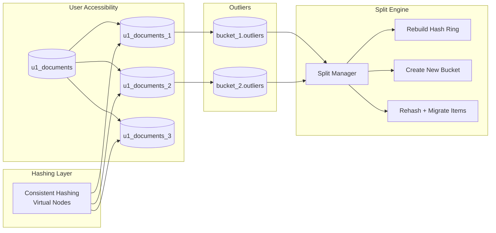
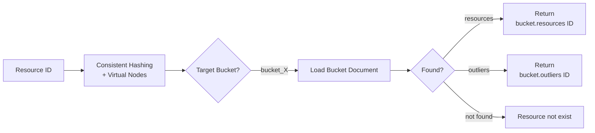
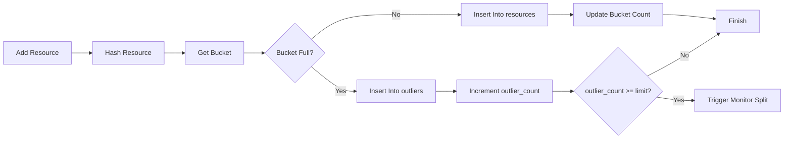
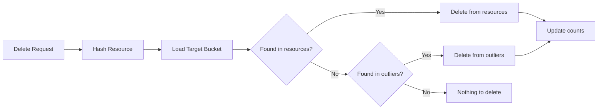
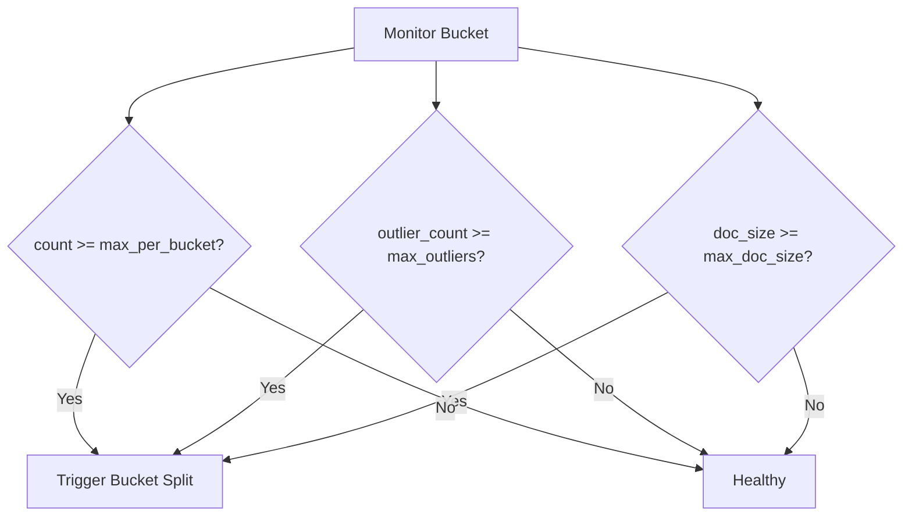
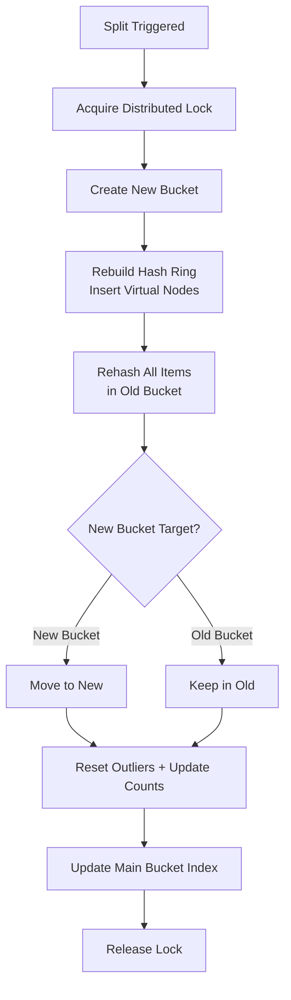
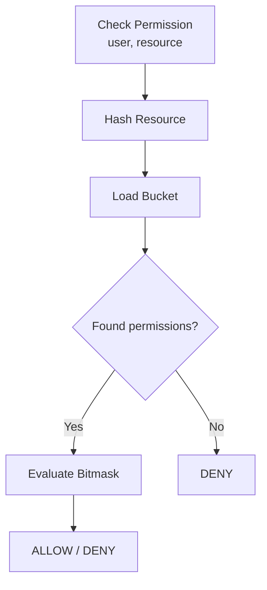

# Bucket management
## Core Architecture Concepts
1. Bucket Pattern
   - Group related resources into logical “buckets” so that:
   - Each bucket contains resources that share similar characteristics.
   - Operations such as lookup, permission aggregation, and snapshot generation become faster and more predictable.

2. Outlier Pattern
   - Store resources that do not fit any bucket rule:
   - Prevents buckets from becoming inconsistent.
   - Keeps rare or exceptional resources isolated so bucket search remains efficient.

3. Consistent Hashing
   - Determine the bucket that should contain a given resource:
   - Ensures stable bucket assignment even when buckets evolve or scale.
   - Virtual nodes are used to balance distribution and provide fast in-memory lookup.

4. Cuckoo Filter
  - Enable extremely fast membership checks:
  - Quickly verify whether a resource exists inside a bucket.
  - Reduces the need to scan bucket content.
  - Useful for checking assigned, granted, or revoked resources with minimal memory footprint.

## Summarize
**Bucket management rule set**
1. Hash → bucket (always one)
2. Add to bucket.resources
3. If full → bucket.outliers
4. If outliers too many → split bucket
5. New bucket → update ring + index
6. Lookup always O(1): check resources or outliers
7. Delete always from hashed bucket only
8. Never place resource in "next bucket"
9. Use locks to prevent double-split
10. Always rehash after split to maintain correctness

## Full Architecture Overview 

## Routing resource & Hash Ring

## Add resource

## Delete resource

## Monitor Trigger split bucket

## Trigger split bucket

## Evaluate permission
