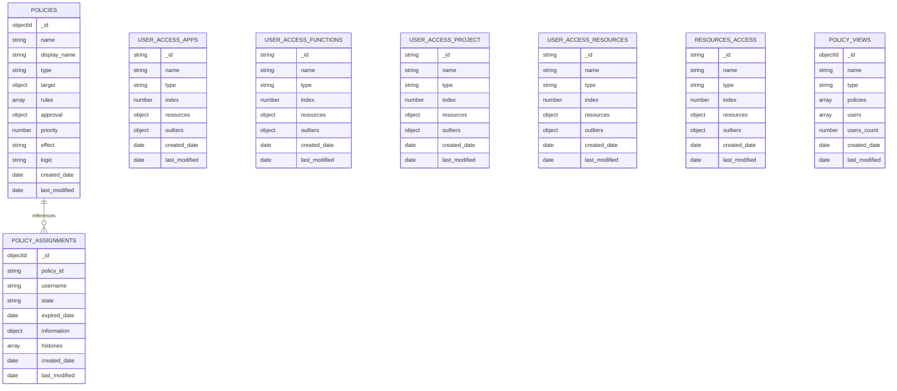

# Policy Management — Design & Spec (v1)

> Scope: manage policies, assign users (with approval), generate persistent accessibility snapshots, and evaluate permissions at runtime for resources: **task, project, document, app, function**.

---

## Revision
| Version | Date       | Author | Approved By | Note          |
| ------- | ---------- | ------ | ----------- | ------------- |
| 1.0.0   | 2023-08-21 | xxx    | xxx         | First release |
|         |            |        |             |               |
|         |            |        |             |               |


## 1) Roles & Use Cases

**Actors**

* **Policy Admin**: CRUD policies; assign users to policies (triggers approval if required by policy).
* **Policy Manager / Approver**: Reviews and approves/denies assignment requests.
* **Client (Runtime)**: Calls Authorization → Policy Engine to evaluate a user against a resource.

**Use cases**

```mermaid
flowchart TB

  %% =======================
  %% Actor Definitions
  %% =======================
  Admin["👤 Admin"]:::role
  Manager["👤 Manager"]:::role

  %% =======================
  %% System Boundary
  %% =======================
  subgraph S["Policy Management System"]
    direction TB

    ucCUD([Manage Policy])
    ucAssign([Assign User to Policy])
    ucApprove([Approve / Reject Assignment Request])
    ucViewApproval([View Assignment Request])

    %% Relationships
    ucAssign -. include .-> ucCUD
    ucApprove -. include .-> ucAssign
    ucViewApproval -. include .-> ucApprove
  end

  %% =======================
  %% Actor ↔ Use-Case Mappings
  %% =======================
  Admin --- ucCUD
  Admin --- ucAssign

  Manager --- ucApprove


  %% Decision paths
  ucApprove -->|Rejected| ucAssign

  classDef role stroke-width:0px;

```


---

## 2) Activity Flow

**High-level activity**


---

## 3) State of Requested Permission (Assignment)


Notes:

* **NEW/undefined** is transient until first transition.
* **Rejected** → physically delete the request (kept in audit log only).

---

## 4) Service components


---

## 5) Sequence Diagrams

### 5.1 Policy CRUD


### 5.2 Assignment Creation


### 5.3 Approval & Generation


### 5.4 Evaluate Policy (Runtime)


### 6 Permission Evaluation Logic (Runtime)


---

## 7) Data Model (MongoDB)

### 7.1 Collections

#### Write-side
* **policies**: master policies.
* **policy_assignments**: per-user assignment requests & lifecycle.

#### Read-side
* **policy_views**: denormalized read views (counts, tags, etc.).
* **user_access_apps**: user → accessible apps.
* **user_access_functions**: user → app → functions + permissions.
* **user_access_projects**: user → project → tasks.
* **user_access_resources**: user → resource_type → resources 
* **resources_access**: resources → user 
* **approval_process**: immutable decisions & history.
* **jobs**: scheduled expirations.

### 7.2 ER (logical)



### 7.3 Indexing (recommended)

* `policies`: `{ name: 1 }` unique, `{ tags: 1 }`, `{ type: 1, priority: 1 }`.
* `policy_assignments`: `{ username: 1, policy_id: 1 }` unique, `{ state: 1 }`, TTL index on `expired_date` (optional sparing).
* `user_access_*`: `{ name: 1 }`.
* `policy_views`: `{ name: 1 }`.

---

## 8) Event Model

**Routing key format**: `[tenant].[app].event.success.[resource].[action]`
**Generic model**:
```json
{
  "time": 1762841553086,
  "action": "approved",
  "resource": { "name": "resource_name" },
  "data": {
    "dynamic_field_1": "abc",
  },
  "executor": {"username":"user1","realm":"default"},
  "id": "7c7f0a7d-51ec-4460-a983-4f23ff83658a"
}
```
---

## 9) Mock JSON Data
### 9.1) Policies (sensible data)

> Includes approval-required vs inherited policies, cross-resource targets, and expressions.

```json
[
  {
    "_id": "67d4efcb86e400d4671cb221",
    "name": "access-platform-identity",
    "display_name": "Identity",
    "type": "platform",
    "description": "Allow user access to platform 'identity'",
    "target": {
      "resources": {
        "apps": [{ "name": "identity" }]
      },
      "actions": []
    },
    "rules": [],
    "effect": "allow",
    "logic": "all",
    "priority": 10,
    "tags": ["app","identity","platform","default","read-only"],
    "created_date": "2025-03-15T03:11:07.892Z",
    "last_modified": "2025-03-17T04:10:41.638Z"
  },
  {
    "_id": "67d4efcb86e400d4671cb222",
    "name": "access-app-administration",
    "display_name": "Administration",
    "description": "Allow user access app 'administration'",
    "type": "application",
    "target": {
      "resources": {
        "apps": [{ "name": "administration" }]
      },
      "actions": []
    },
    "rules": [
      {
        "effect": "allow",
        "logic": "any",
        "conditions": [
          { "scope": "user", "path": "role", "operator": "eq", "value": "admin" },
          { "expression": "(ctx) => ctx.user.role === 'admin'" }
        ]
      },
      {
        "effect": "allow",
        "logic": "all",
        "policies": ["67d4efcb86e400d4671cb221"]
      }
    ],
    "effect": "allow",
    "logic": "all",
    "priority": 9,
    "tags": ["app","identity","platform"],
    "created_date": "2025-03-15T03:11:07.892Z",
    "last_modified": "2025-03-17T04:10:41.638Z"
  },
  {
    "_id": "67d4efcb86e400d4671cb223",
    "name": "access-function-user-management",
    "display_name": "User Management",
    "description": "Allow user access to 'user-management' in app 'administration'",
    "type": "access-control",
    "target": {
      "resources": {
        "functions": [{ "name": "user-management" }]
      },
      "actions": ["CREATE_USER","DELETE_USER"]
    },
    "rules": [
      {
        "effect": "allow",
        "logic": "all",
        "policies": ["67d4efcb86e400d4671cb221","67d4efcb86e400d4671cb222"]
      }
    ],
    "effect": "allow",
    "logic": "all",
    "priority": 8,
    "tags": ["user","administration","identity"],
    "created_date": "2025-03-15T03:11:07.892Z",
    "last_modified": "2025-03-17T04:10:41.638Z"
  }
]

```

---

### 9.2) Assignments & Snapshots

**Assignment**

```json
{
  "_id": "67d4efcb86e400d4671cb888",
  "policy_id": "67d4efcb86e400d4671cb231",
  "username": "u1",
  "state": "active",
  "expired_date": "2025-06-01T00:00:00.000Z",
  "created_date": "2025-03-15T03:11:07.892Z",
  "last_modified": "2025-03-17T04:10:41.638Z",
  "histories": [
    {"action":"created","executor":"admin","time":"2025-03-15T03:11:07.892Z","message":"Submitted"}
  ],
  "information": {"title":"ceo","manager":"man1","full_name":"User One"}
}
```


**Accessibility snapshot with bitmask** 

- Main bucket (index)
```json
{
  "_id": "u1_documents",
  "name": "u1",
  "type": "documents",
  "buckets": {
    "u1_documents_1": {
      "id": "u1_documents_1",
      "range": "0-1999",
      "count": 1820,
      "outliers": 12
    },
    "u1_documents_2": {
      "id": "u1_documents_2",
      "range": "2000-3999",
      "count": 1675,
      "outliers": 8
    },
    "u1_documents_3": {
      "id": "u1_documents_3",
      "range": "4000-5999",
      "count": 423,
      "outliers": 1
    }
  },
  "hashing": {
    "algo": "consistent-hash-sha1",
    "virtual_nodes": 50,
    "rebalanced_date": "2025-03-15T07:47:31.415Z"
  },
  "split_policy": {
    "max_per_bucket": 5000,
    "max_outliers": 300,
    "max_document_size_MB": 10
  },
  "stats": {
    "total_buckets": 3,
    "total_resources": 3918
  },
  "created_date": "2025-03-15T07:47:31.415Z",
  "last_modified": "2025-05-15T10:12:41.215Z"
}

```
- User's accessibility (Subject = user)
  - Id format : `[username]_[bucket id]`
```json
{
  "_id": "u1_documents_1",
  "name": "u1",
  "type": "documents",
  "index": 1,

  "resources": {
    "doc_00010": 17,
    "doc_00014": 9,
    "doc_00231": 4,
    "doc_00999": 17,
    "doc_01001": 9
  },

  "outliers": {
    "doc_99881": 17,
    "doc_99882": 9,
    "doc_99895": 4,
    "doc_99920": 17
  },

  "count": 1420,
  "outlier_count": 4,

  "created_date": "2025-03-15T07:47:31.415Z",
  "last_modified": "2025-05-15T10:10:23.115Z"
}
```

- Resources's granted (Subject = resources)
  - Id format : `[resource id]_[bucket id]`
```json
{
  "_id": "r1_documents_1",
  "name": "Doc XXX",
  "type": "documents",
  "index": 1,

  "resources": {
    "u_40001": 9,
    "u_45231": 17,
    "u_49990": 4
  },

  "outliers": {},

  "count": 3,
  "outlier_count": 0,

  "created_date": "2025-03-15T07:47:31.415Z",
  "last_modified": "2025-05-15T10:09:12.015Z"
}

```

<!-- 
**Apps snapshot**

```json
{
  "_id": "67d4efcb86e400d4671cb889",
  "username": "u1",
  "apps": [ { "name": "administration", "display_name": "Administration" } ],
  "created_date": "2025-03-15T07:47:31.415Z",
  "last_modified": "2025-03-15T07:47:31.415Z"
}
```

**Functions snapshot**

```json
{
  "_id": "67d4efcb86e400d4671cb885",
  "username": "u1",
  "app_name": "administration",
  "functions": [ { "name":"user-management","display_name":"User management","permissions":["CREATE_USER","DELETE_USER"] } ],
  "created_date": "2025-03-15T07:47:31.415Z",
  "last_modified": "2025-03-15T07:47:31.415Z"
}
```

**Projects snapshot**

```json
{
  "_id": "67d4efcb86e400d4671cb990",
  "username": "u1",
  "project_id": "1234",
  "tasks": [
    {
      "task_def_key": "verify-entry",
      "display_name": "Verify Data Entry",
      "permissions": ["CLAIM_TASK","SEARCH_TASK"]
    }
  ],
  "created_date": "2025-03-15T07:47:31.415Z",
  "last_modified": "2025-03-15T07:47:31.415Z"
}
```

**Resources snapshot** 

```json
{
  "_id": "67d4efcb86e400d4671cb990",
  "username": "u1",
  "resource_id": "1234",
  "permissions": [ "CLAIM_TASK","SEARCH_TASK"],
  "created_date": "2025-03-15T07:47:31.415Z",
  "last_modified": "2025-03-15T07:47:31.415Z"
}
``` -->

**Policy view**

```json
{
  "_id": "policy_id",
  "name": "Administration",
  "description": "App access",
  "type": "access-control",
  "policies": [ { "id":"67d4efcb86e400d4671cb222", "name":"access-app-administration", "display_name":"Administration" } ],
  "users": [ "u1" ],
  "users_count": 1,
  "created_date": "2025-03-15T07:47:31.415Z",
  "last_modified": "2025-03-15T07:47:31.415Z"
}
```

---

### 9.3 Event Data

* `default.identity.event.success.policies.created`
```json
{
  "time": 1762841553086,
  "action": "created",
  "resource": { "name": "policies" },
  "data": {
    "id": "67d4efcb86e400d4671cb722",
    "type":"application",
    "name": "access-app-administration",
  },
  "executor": {"username":"admin","realm":"default"},
  "id": "7c7f0a7d-51ec-4460-a983-4f23ff83658a"
}
```

* `default.identity.event.success.assignments.requested`
* `default.identity.event.success.assignments.approved`
* `default.identity.event.success.assignments.rejected`

```json
{
  "time": 1762841553086,
  "action": "approved",
  "resource": { "name": "assignments" },
  "data": {
    "approval_id": "67d4efcb86e400d4671cb722",
    "approvers":[],
    "policy_id": "67d4efcb86e400d4671cb722",
    "policy_type":"application",
    "policy_name": "access-app-administration",
    "users": ["u1"],
    "expired_date": "2025-03-17T04:10:41.638Z"
  },
  "executor": {"username":"approver1","realm":"default"},
  "id": "7c7f0a7d-51ec-4460-a983-4f23ff83658a"
}
```


* `default.identity.event.success.accessibility.expired`
```json
{
  "action": "expired",
  "time": 1763014280018,
  "resource": { "name": "accessibility" },
  "data": {
    "policy_id": "572c6f54-540b-58ba-8505-6c8484179676",
    "policy_type":"application",
    "policy_name": "access-app-administration",
    "users": ["u1"],
    "expired_date": "2025-03-17T04:10:41.638Z"
  },
  "id": "7c7f0a7d-51ec-4460-a983-4f23ff83658a"
}
```

* `default.identity.event.success.accessibility.changed`
```json
{
  "action": "changed",
  "time": 1763014280018,
  "resource": { "name": "accessibility" },
  "data": {
    "user": {
      "username": "u1",
      "realm": "default"
    },
    "add": [
      {
        "id": "policy_id",
        "type": "policy_type",
      
        "resources": { // affected resource
          "app": "account",
          "functions": [{
            "name": "user-profile",
            "display_name": "Profile info",
            "permissions": []
          }],
          "documents": [
            {
              "id": "xxx"
            }
          ],
          "project": "123",
          "tasks": []
        },
        "expired_date": "2025-03-17T04:10:41.638Z"
      }
    ],
    "remove": []
  }
}
```

## 10) Evaluation Semantics

### 10.1 Policy Structure

- `effect`: "allow" | "deny"
  - When priority ties: deny overrides allow.
- `logic`: "all" | "any"
  - How conditions / inherited policies combine.
- `priority` (number): higher wins.
- `rules[].conditions[]`: { scope, path, operator, value } or expression: function(ctx).
- `rules[].policies[]`: IDs of inherited policies (resolved during compile step).

### 10.2 Evaluation Steps

```ts
1. Sort all policies by priority descending.
2. Identify highest priority value that appears.
3. Evaluate ONLY policies in this top-priority group.
4. For each such policy:
     - Evaluate rule
     - If rule passed → add to matched[]
     - If effect == "deny" → final = DENY (stop immediately)
     - Else if effect == "allow" → final = ALLOW (unless denied later)
5. If no matched policies → DENY.
6. Return result { allowed, matchedPolicies }.
```

**Example**:
```bash

- P1: priority=10, effect=allow, matches
- P2: priority=10, effect=deny, matches
- P3: priority=5,  effect=allow, matches

Result:
- Only priority 10 is considered
- deny (P2) overrides allow (P1)
- Final: DENY

```
### 10.3 Rule Evaluation
If `policy.rules` is empty:
  - Use `policy.effect` as default.
  
Else:
  - `rules[]` is used

For a rule:
  - If no conditions → use `rule.effect`.
  - Else evaluate each condition → combine values:
    - `logic = "all"` → all must be true.
    - `logic = "any"` → at least one true.

### 10.4 Condition Evaluation
Given:
```json
{
  "scope": "user",
  "path": "information.title",
  "operator": "eq",
  "value": "ceo"
}
```
Steps:

1. select root: ctx.user
2. resolve field: user.information.title
3. apply operator:
   - eq / ne
   - in / nin
   - gt / lt / gte / lte
   - contains / startsWith / endsWith

If `expression` exists:
evaluate compiled JS function in sandbox

---

## 11) Scheduler & Expiration

* On `accessibility.changed`: schedule job at `expired_date` (if present) and emit `accessibility.expired`
* On `accessibility.expired`: trigger re-generation when cascading needed.

---

## 12) API (Admin)

* Policy `type`:
  * `platform`
  * `application`
  * `access-control`
  * `resources`
  *  ...(more if needed)

* Policy `resources`: 
  * `apps_groups`
  * `apps`
  * `roles` 
  * `functions`
  * `permissions`
  * `sharing`
  *  ...(more if needed)

* Policy `tags`:
  * `default`
  * `read-only`
  *  ...(more if needed)
  
* Policy resources url structure:
  * /policies/{id} : access to policy evaluation
  * /policies/definitions : access to policy definition
  * /policies/users : access to relevant users 
  * /policies/views/{type} : access to generated view data type
  * /policies/assignment : access to approval process assign user

### 12.1 Policies

* `POST /policies/definitions` -> create policy

  * Request Body:

  ```json
  // example create application
  {
    // section: simple policy access to resource
    "name": "administration",
    "displayName": "Administration",
    "description": "Access Application Administration",
    "type": "application",
    "tags": ["identity"],

    // section: manage access control for role
    "target": {
      "resources": {
        "apps": [{ "name": "administration" }],
      },
      "actions": []
    },

    // section: evaluated rule
    "approval": {},
    "rules": [],
    "effect": "allow",
    "logic": "all",
    "priority": 1,
  }

  // example create group application
  {
    "name": "identity",
    "displayName": "Identity",
    "description": "Identity group",
    "type": "group-application",
    "tags": ["identity"],
    
    // section: manage access control for role
    "target": {
      "resources": {
        "apps_groups": ["identity"], 
        "policies":["policy_id_administration"],
      },
      "actions": []
    },

    "approval": {
      "active": true,
      "approvers": [
        {
          // by attribute type of subject
          "type": "username",
          "value": ["admin"], 
        },
        {
          "type": "role",
          "value": ["security_officer"], 
        },
        {
          "type": "title",
          "value": ["Senior Engineer"], 
        }
      ]
    },
    "rules": [],
    "effect": "allow",
    "logic": "all",
    "priority": 1,
  }

   // example create separation function permission
  {
    "name": "user-management",
    "displayName": "User Management",
    "description": "Policy manage user in application",
    "type": "functions",
    "tags": ["user","identity"],
    
    "target": {
      "resources": {
        "functions": ["user-management"],
      },
      "actions": [
        "CREATE_USER"
      ]
    },

    "approval": {},
    "rules": [],
    "effect": "allow",
    "logic": "all",
    "priority": 1,
  }

  // example create share
  {
    "name": "share-document-xxx",
    "displayName": "Share document XXX",
    "description": "Policy share document xxx",
    "type": "documents",
    "tags": ["dms","document"],
    "target": {
      "resources": {
        "documents": [{"name":"xxx"}]
      },
      "actions": [
        "VIEW_DETAIL_DOCUMENT",
        "ARCHIVE_DOCUMENT"
      ]
    },
    "approval": {
      "active": true,
      "logic": "any",
      "approvers": [
        {
          "type": "username",
          "value": ["admin"]
        }
      ]
    },
    "rules": [],
    "effect": "allow",
    "logic": "all",
    "priority": 1,
  }
  ```  

* `PUT /policies/definitions/:id`

* `DELETE /policies/definitions/:id`

* `POST /policies/views/search`

  * Request Body:

  ```json
  {
    "_filter": { "type": "policy_type" }
  }
  ```

  * Response:

  ```json
  [
   {
    "id": "string",
    "name": "string",
    "displayName": "string",
    "description": "string",
    "totalUsers": 10,
    "createdDate": "2025-03-15T03:11:07.892Z",
    "lastModified":"2025-03-15T03:11:07.892Z",
   }
  ]
  ```   

* `GET /policies/views/:id`

  * Response:

  ```json
   {
    "id": "string",
    "name": "string",
    "displayName": "string",
    "description": "string",
    "users":["u1"],
    "policies": [
        { // nested policies
          "id":"policy_id_administration",
          "type": "application",
          "name":"",
          "displayName":"",
          "policies":[]
        }
      ]
    "createdDate": "2025-03-15T03:11:07.892Z",
    "lastModified":"2025-03-15T03:11:07.892Z",
   }
  ```


* `POST /policies/views/:id/users/search` -> search user has policy

  * Request Body:

  ```json
  {
    "_filter": {}
  }
  ```

  * Response:

  ```json
  [
    {
      "id": "68f9c8619fe455abff917cea",
      "username": "u1",
      "fullName": "User One",
      "jobTitle": "CEO",
      "lineManagerFullName": "Manager A",
      "createdDate": "2025-10-23T06:17:05.668Z",
      "expiredDate": "2025-12-31T06:17:05.668Z",
      "status": "requested"
    }
  ]
  ```

* `GET /policies/views/:id/activities/all` -> get activities

  * Response:

  ```json
  [
    {
      "id": "68f9c8619fe455abff917cea_1761200225657",
      "action": "requested",
      "comment": "The approval for assignment has been requested by admin.",
      "createdDate": "2025-10-23T06:17:05.668Z",
      "createdBy": {
        "email": "mail_demo2@digi-texx.vn",
        "username": "admin"
      },
      "time": 1761200225657
    }
  ]
  ```
---

### 12.2 Assignment & Approval

* Assignment status: `new`, `requested`, `expired`, `active`

* `POST /policies/assignment/request` -> create assignment request

  * Request Body:

  ```json
    {
      "policyId":"xxx",
      "users": ["user1", "user2"],
      "expiredDate": "2025-12-31T00:00:00.000Z"
    }
  ```

* `POST /policies/assignments/approval/search`

  * Response:

  ```json
  [
    {
      "id": "69085585917c157622bcaf16",
      "description": "xxxxx",
      "requestedBy": "admin",
      "requestedDate": "2025-11-03T07:11:01.779Z",
      "assigneeUsername":"asigned_user",
      "assigneeFullName":"Asigned User",
      "resourceType": "applications",
      "resource": {
        "id": "690855859fe455abff91b6ae",
        "name": "administration",
      },
      "createdDate": "2025-11-03T07:11:01.790Z",
      "lastModified": "2025-11-03T07:11:01.790Z"
    }
  ]
  ```

* `PATCH /policies/assignments/approval/:id/approve`

  * Request Body (optional):

  ```json
  { "comment": "Approved by policy manager." }
  ```

* `PATCH /policies/assignments/approval/:id/reject`

  * Request Body (optional):

  ```json
  { "comment": "Rejected: Missing authorization." }
  ```

---

## 13) Events → Actions

| Event                   | Producer           | Consumers                                        |
| ----------------------- | ------------------ | ------------------------------------------------ |
| `policies.created`      | Policy Registry    | Policy Views, Activity Log                       |
| `assignments.requested` | Assignment Service | Views, Log                                       |
| `assignments.rejected`  | Assignment Service | Assignments, Views, Log                          |
| `assignments.approved`  | Assignment Service | Access Generator, Views, Log                     |
| `accessibility.expired` | Scheduler          | Assignments, Access Generator, Policy Views, Log |
| `accessibility.changed` | Access Generator   | Log, downstream apps                             |


---

## 14) Bitmask Permission (resources)
Define mask per resource-type (example `documents`):
Just example, that values are difference for each project

* `1`: VIEW
* `2`: EDIT
* `4`: SHARE
* `8`: DELETE
* Combine via OR; check via AND.

---

## 15) Non-functional

* **Idempotency**: all generators upsert by `(username, scope)` keys.
* **Consistency**: write-side emits events; read-side views catch-up eventually.
* **Observability**: log decision reasons, assignment lifecycle, generator run-id.
* **Security**: sign evaluation expressions; sandbox execution.

---

## 16) Gaps & Next

* JSON Schema / Zod for policy & assignment (validation).
* Assignment histories may change to log activity
* Convert snapshot data to bitmap permission for better performance

## 17) Implementation Convention - CQRS Architecture

### Implementation  - Folder structure

```json
root
│
├─ src
│   ├─ main.ts
│   ├─ app.module.ts
│   └─ environment.d.ts
│
├─ apps
│   ├─ policy
│   │   ├─ policy.module.ts
│   │   │
│   │   ├─ domain
│   │   │   ├─ entities
│   │   │   │   ├─ policy.entity.ts
│   │   │   │   ├─ policy-view.entity.ts
│   │   │   │   └─ policy-activity.entity.ts
│   │   │   ├─ repository
│   │   │   │   ├─ policy.repository.ts
│   │   │   │   ├─ policy-view.repository.ts
│   │   │   │   └─ policy-activity.repository.ts
│   │   │   └─ services
│   │   │       ├─ policy-evaluator.service.ts
│   │   │       └─ expression-evaluator.service.ts
│   │   │
│   │   ├─ application
│   │   │   ├─ command
│   │   │   │   ├─ create-policy
│   │   │   │   │   ├─ create-policy.command.ts
│   │   │   │   │   └─ create-policy.handler.ts
│   │   │   │   ├─ update-policy
│   │   │   │   │   ├─ update-policy.command.ts
│   │   │   │   │   └─ update-policy.handler.ts
│   │   │   │   ├─ delete-policy
│   │   │   │   │   ├─ delete-policy.command.ts
│   │   │   │   │   └─ delete-policy.handler.ts
│   │   │   │
│   │   │   ├─ query
│   │   │   │   ├─ search-policies
│   │   │   │   │   ├─ search-policies.query.ts
│   │   │   │   │   └─ search-policies.handler.ts
│   │   │   │   ├─ get-policy-view
│   │   │   │   │   ├─ get-policy-view.query.ts
│   │   │   │   │   └─ get-policy-view.handler.ts
│   │   │   │   ├─ search-policy-users
│   │   │   │   │   ├─ search-policy-users.query.ts
│   │   │   │   │   └─ search-policy-users.handler.ts
│   │   │   │   ├─ get-policy-activities
│   │   │   │   │   ├─ get-policy-activities.query.ts
│   │   │   │   │   └─ get-policy-activities.handler.ts
│   │   │   │   └─ list-policy-types
│   │   │   │       ├─ list-policy-types.query.ts
│   │   │   │       └─ list-policy-types.handler.ts
│   │   │
│   │   ├─ presentation
│   │   │   └─ controllers
│   │   │       └─ policy.controller.ts
│   │
│   ├─ assignment
│   │   ├─ assignment.module.ts
│   │   │
│   │   ├─ domain
│   │   │   ├─ entities/assignment.entity.ts
│   │   │   └─ repository/assignment.repository.ts
│   │   │
│   │   ├─ application
│   │   │   ├─ command
│   │   │   │   ├─ request-assignment
│   │   │   │   ├─ approve-assignment
│   │   │   │   ├─ reject-assignment
│   │   │   │   └─ expire-assignment
│   │   │   └─ query
│   │   │       ├─ search-assignments
│   │   │       └─ get-assignment-detail
│   │   │
│   │   ├─ presentation
│   │   │   └─ controllers
│   │   │       └─ assignment.controller.ts
│
│   ├─ evaluation
│   │   ├─ evaluation.module.ts
│   │   ├─ application
│   │   │   └─ query/evaluate-policy
│   │   │       ├─ evaluate-policy.query.ts
│   │   │       └─ evaluate-policy.handler.ts
│   │   ├─ presentation
│   │   │   └─ controllers
│   │   │       └─ evaluation.controller.ts
│
│   ├─ access-generator
│   │   ├─ access-generator.module.ts
│   │   │
│   │   ├─ domain
│   │   │   ├─ entities/user-app-access.entity.ts
│   │   │   └─ repository/user-app-access.repository.ts
│   │   │
│   │   ├─ application
│   │   │   ├─ command
│   │   │   │   ├─ generate-user-access
│   │   │   │   └─ expire-user-access
│   │   │   └─ query/get-user-access-view
│   │   │
│   │   ├─ presentation
│   │   │   └─ controllers
│   │   │       └─ access-view.controller.ts
│
│   └─ scheduler   ← optional future module
│
├─ libs
│   ├─ shared
│   │   ├─ in-memory-db.ts
│   │   ├─ common.types.ts
│   │   ├─ dto
│   │   └─ utils
│   │
│   ├─ infra
│   │   ├─ database
│   │   ├─ redis
│   │   ├─ event-bus
│   │   └─ service-registry
│   │
│   └─ domain
│       └─ base-event.ts
│
└─ test
    ├─ policy
    ├─ assignment
    ├─ evaluation
    ├─ access-generator
    └─ e2e


```

```js
test/
 ├── policy/
 │    ├── domain/
 │    │   ├── policy.entity.spec.ts
 │    │   ├── rule.vo.spec.ts
 │    │   └── approver.vo.spec.ts
 │    ├── application/
 │    │   ├── command/
 │    │   │   ├── create-policy/
 │    │   │   │   └── create-policy.handler.spec.ts
 │    │   │   ├── update-policy/
 │    │   │   │   └── update-policy.handler.spec.ts
 │    │   │   ├── delete-policy/
 │    │   │   │   └── delete-policy.handler.spec.ts
 │    │   │   ├── approve-policy/
 │    │   │   │   └── approve-policy.handler.spec.ts
 │    │   │   └── compile-policy/
 │    │   │       └── compile-policy.handler.spec.ts
 │    │   ├── query/
 │    │   │   ├── search-policies/
 │    │   │   │   └── search-policies.handler.spec.ts
 │    │   │   ├── get-policy-view/
 │    │   │   │   └── get-policy-view.handler.spec.ts
 │    │   │   ├── search-policy-users/
 │    │   │   │   └── search-policy-users.handler.spec.ts
 │    │   │   └── get-policy-activities/
 │    │   │       └── get-policy-activities.handler.spec.ts
 │    ├── infra/
 │    │   └── policy.mongo-repository.spec.ts
 │    └── interfaces/
 │         └── policy.controller.spec.ts
 │
 ├── assignment/
 │    ├── application/
 │    │   ├── request-assignment.handler.spec.ts
 │    │   ├── approve-assignment.handler.spec.ts
 │    │   ├── reject-assignment.handler.spec.ts
 │    │   └── expire-assignment.handler.spec.ts
 │    └── interfaces/
 │         └── assignment.controller.spec.ts
 │
 ├── access-generator/
 │    ├── domain/
 │    │   └── bitmask-calculator.spec.ts
 │    ├── application/
 │    │   ├── generate-user-access.handler.spec.ts
 │    │   └── expire-user-access.handler.spec.ts
 │    └── interfaces/
 │         └── access-view.controller.spec.ts
 │
 ├── evaluation/
 │    ├── evaluator/
 │    │   ├── js-expression-evaluator.spec.ts
 │    │   ├── condition-evaluator.spec.ts
 │    │   └── policy-evaluator.spec.ts
 │    └── application/
 │         └── evaluate-policy.handler.spec.ts
 │
 └── e2e/
      ├── policy.e2e-spec.ts
      ├── assignment.e2e-spec.ts
      └── authorization.e2e-spec.ts
```

### Implementation - TODO tasks

## **1. Initialize Codebase**
## **2. Module: Policy Management**

### **2.1 CRUD + Validation**

* [ ] Create/Update/Delete policy definitions.
* [ ] Schema validation for:

  * target.resources
  * approval rules
  * conditions & expressions
  * priority/effect/logic

### **2.2 Compile & Normalize Policies**

* [ ] Resolve inherited rules (`rules[].policies[]`).
* [ ] Pre-compile JS expressions (sandbox).
* [ ] Build policy_view:

  * normalized resources
  * flattened nested policies
  * counts, tags, metadata

### **2.3 Event Emission**

* [ ] Emit:

  * `policies.created`
  * `policies.updated`
  * `policies.deleted`
* [ ] Optional: Write activity logs (policy lifecycle).

---

## **3. Module: Assignment (Request → Approval → Active → Expired)**

### **3.1 Request Workflow**

* [ ] Create assignment request (REQUESTED).
* [ ] Check approval rule of policy.
* [ ] Store request & audit log.

### **3.2 Approval Workflow**

* [ ] Approve request → mark REQUESTED → ACTIVE.
* [ ] Reject → delete request + audit entry.
* [ ] Update assignment state machine.
* [ ] On approve: validate expiration date.

### **3.3 Event Emission**

* [ ] `assignments.requested`
* [ ] `assignments.approved`
* [ ] `assignments.rejected`
* [ ] `assignments.assigned` (optional, after ACTIVE)

---

## **4. Module: Scheduler (Expiration)**

### **4.1 Job Scheduling**

* [ ] When assignment is approved && updated accessibility:
  * schedule job at `expired_date`
* [ ] Store job in `jobs` collection.

### **4.2 Job Execution**

* [ ] On due:

  * mark assignment as EXPIRED
  * emit `policies.expired`
  * trigger access-generator cleanup
  * write activity log

### **4.3 TTL / Auto-cleanup (optional)**

* [ ] TTL index for non-active requests.
* [ ] Clear stale scheduler jobs.

---

## **5. Module: Access Generator (Snapshot Builder)**

### **5.1 Bucket + Bitmask Engine**

* [ ] Implement consistent hashing (virtual nodes is optional).
* [ ] User buckets:

  * resources per type
  * bucket indexing
  * outlier handling
  * split policy
* [ ] Reverse buckets (resource → user).

### **5.2 Snapshot Generation**

Generate access snapshot for:

* [ ] Apps
* [ ] Functions
* [ ] Projects → tasks
* [ ] Resources (bitmask, bucketed)

### **5.3 Index & Integrity Tasks**

* [ ] Rebuild bucket index after split.
* [ ] Ensure bucket uniqueness:
  - `[username]_[bucket]`
  - `[resource_type]_[bucket]`

### **5.4 Event Emission**

* [ ] Emit `accessibility.changed` after every generator run.

---

## **6. Module: Evaluation (Runtime Authorization)**

### **6.1 Bucket Index Sync** (optional)

* [ ] Cache bucket index in memory/Redis.
* [ ] Warm-up or lazy loading.

### **6.2 Lookup + Evaluate**

* [ ] Resolve bucket for resource.( from cache or DB)
* [ ] Pull bucket snapshot.
* [ ] Retrieve user bitmask.
* [ ] Reverse bitmask → full permission list.

### **6.3 Policy Engine (ABAC)**

* [ ] Load compiled policies by type/scope.
* [ ] Evaluate with priority rules:

  * sort by priority desc
  * evaluate highest priority group only
  * deny > allow in same priority

### **6.4 Return Result**

* [ ] `{ allowed, permissions, matchedPolicies, reasons }`

---

## **7. Integration with Identity Module**

### **7.1 Application → Policy Wrap**

* [ ] For each app created in Identity:

  * auto-generate a policy definition
  * build a `policy_view`

### **7.2 Group Application → Policy Wrap**

* [ ] For each app group:

  * create group-level policy
  * link nested policies
  * regenerate `policy_views`

### **7.3 Sync Identity Attributes** (Optional)

* [ ] attributes (role, title, department…) used in ABAC evaluation.

---

# **Final Summary (High-Level Checklist)**

### **Core Modules**

* [ ] Policy Management
* [ ] Assignment
* [ ] Scheduler
* [ ] Access Generator
* [ ] Evaluation
* [ ] Identity Integration

### **Core Workflows**

* [ ] Define policy
* [ ] User assignment + approval
* [ ] Event dispatch
* [ ] Accessibility snapshot generation
* [ ] Bucket management
* [ ] Runtime evaluation

---
